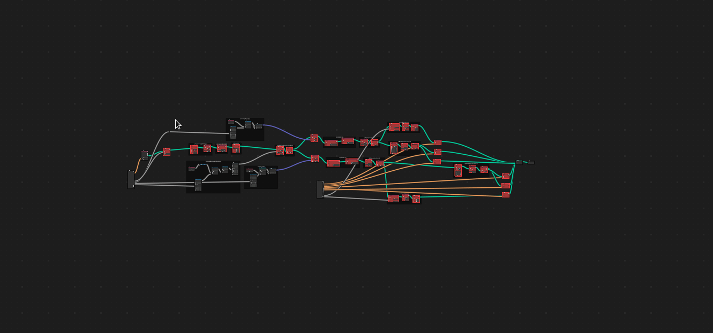

# Blender Addon : Suffle Node

Shuffle selected node in Blender Node Editor

## ⚙️ Installation

1. Download latest version from [Release](https://github.com/Ni-g-3l/blender-shuffle-node/releases)
2. Install it with Blender Addon Manager

## 🔢 Versioning

We use [SemVer](http://semver.org/) for versioning. For the versions available, see the [tags on this repository](https://github.com/Ni-g-3l/blender-shuffle-node/tags).

## 🤹 Authors / Contributers / Attributions

* **Nig3l** - *Main Developer* - [Github](https://github.com/Ni-g-3l/)

See also the list of [contributors](https://github.com/Ni-g-3l/blender-shuffle-node/contributors) who participated in this project.

## 📃 License

This project is licensed under the MIT License - see the [LICENSE.md](LICENSE) file for details.

Individiual licensing arrangements can be made if this is an issue for your project - Contact Me at [LinkedIn](https://www.linkedin.com/in/maxime-cots) to discuss.

## 👏 Acknowledgments

 Icons made by <a href="https://www.flaticon.com/authors/uniconlabs" title="Uniconlabs"> Uniconlabs </a> from <a href="https://www.flaticon.com/" title="Flaticon">www.flaticon.com'</a>

* **Billie Thompson** - *README & Contribution Templates* - [PurpleBooth](https://github.com/PurpleBooth)
